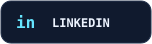
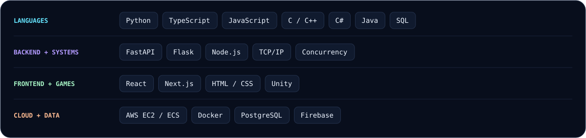
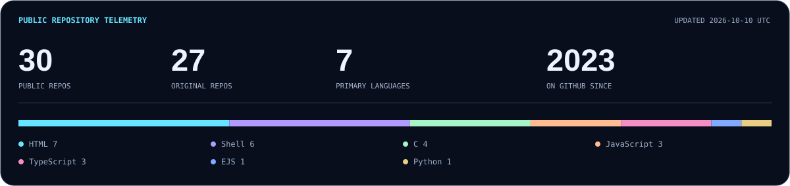
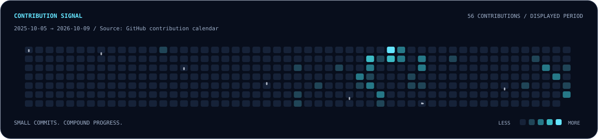
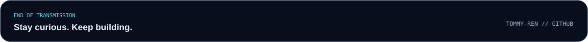

<p align="center">
  <picture>
    <source media="(max-width: 600px)" srcset="./assets/hero-mobile.svg" />
    
  </picture>
</p>

<p align="center">
  <a href="https://www.linkedin.com/in/tommy-ren"></a>
  &nbsp;
  <a href="mailto:tra42@sfu.ca"></a>
</p>

<p align="center">
  <strong>Building reliable systems. Exploring intelligent software. Making ideas playable.</strong><br />
  <sub>Burnaby, BC, Canada &nbsp; / &nbsp; Simon Fraser University &nbsp; / &nbsp; BCIT alumnus</sub>
</p>


### 01 / Behind the terminal

I'm **Tommy**, a Computing Science student at **Simon Fraser University**, concentrating on **Artificial Intelligence** with a **minor in Statistics**. I graduated from **BCIT's Computer Systems Technology** program with a concentration in **Predictive Analytics**.

My work spans **backend services, cloud infrastructure, full-stack applications, and game systems**. I like understanding how things work beneath the interface: the network protocol, the data pipeline, the runtime, and the tests that keep everything honest.

- **Game development** — modular C# gameplay systems, Unity Editor tooling, performance optimization.
- **Backend & cloud** — Flask APIs, recommendation systems, PostgreSQL, and AWS EC2 / ECS.
- **Product engineering** — React / TypeScript applications, Firebase integration.
- **Beyond the UI** — TCP sockets, concurrent C programs, retinal image segmentation, and procedural planet generation.

```typescript
const tommy = {
  focus: [
    "Backend & Systems", "Applied AI",
    "Full-Stack", "Game Development",
  ],
  approach: "Understand. Build. Test.",
  curiosity: "Look beneath the interface.",
};
```

### 02 / Tools in my orbit

<picture>
  <source media="(max-width: 600px)" srcset="./assets/stack-mobile.svg" />
  
</picture>

### 03 / Signal from GitHub





<p align="center"><sub>Public GitHub data · refreshed daily by <a href="https://github.com/Tommy-Ren/Tommy-Ren/actions/workflows/refresh-profile.yml">GitHub Actions</a> · primary languages are counted by repository, not lines of code.</sub></p>


<p align="center">
  <strong>Have an interesting problem? Let's build something worth opening.</strong><br /><br />
  <a href="mailto:tra42@sfu.ca">Email</a> &nbsp; / &nbsp; <a href="https://www.linkedin.com/in/tommy-ren">LinkedIn</a>
</p>

<p align="center"></p>

<!-- Website link can be added when Tommy-Ren.github.io is published. -->
<!-- Visual and automation inspiration: https://github.com/BEPb/BEPb. Original artwork and implementation for Tommy Ren. -->
